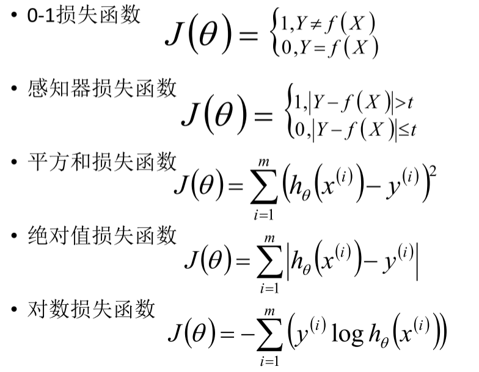
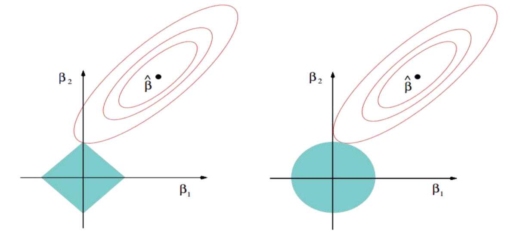

[TOC]

# 机器学习概述

> **机器学习定义：**机器学习是一门从数据中研究算法的科学学科；机器学习直白来讲，是根据已有的数据，进行算法选择，并基于算法和数据构建模型，最终对未来进行预测
>
> **机器学习**是人工智能的一个分支。我们使用计算机设计一个系统，使它能够根据提供的训练数据按照一定的方式来学习；随着训练次数的增加，该系统可以在性能上不断学习和改进；通过参数优化的学习模型，能够用于预测相关问题的输出
>
> **备注：**机器学习就是一个模拟人决策过程的一种程序结构

* 结构图形化：

## 基本概念

***

* **拟合：**构建的算法模型符合给定数据的特征
  **过拟合：**算法太符合样本数据的特征，对于实际生产中的数据特征无法拟合
  **欠拟合：**算法不太符合样本的数据特征

* $x_{i}$：X 向量的第 i 维度的值
  $x^{(i)}$：表示第 i 个样本的X向量

* **鲁棒性：**也就是健壮性、稳健性、强健性,是系统的健壮性；当存在异常数据的时候，算法也会拟合数据

## 对象-目标函数-算法-模型

***

>  对于某给定的任务T，在合理的**性能度量方案P**的前提下，某计算机程序可以**自主学习任务T**的**经验E**；随着提供合适、优质、大量的经验E，该程序对于任务T的性能逐步提高
>
> 其中重要的机器学习对象：
> **任务Task T**，一个或多个、**经验Experience E**、**度量性能Performance P**
> 即：随着任务的不断执行，经验的累积会带来计算机性能的提升

> 目标函数f未知（无法得到）：**假设函数g类似函数f**，但是可能和函数f不同；机器学习中是无法找到一个完美的函数f
>
> 机器学习：从数据中获得一个假设的函数g，使其非常接近目标函数f的效果。

> 算法(T)：根据业务需要和数据特征选择的相关算法， 也就是一个**数学公式**
> 模型(E)：基于数据和算法构建出来的模型
> 评估/测试(P)：对模型进行评估的策略

## 机器学习-数据分析-数据挖掘区

***

* **数据分析：**数据分析是指用适当的统计分析方法对收集的大量数据进行分析，并提取有用的信息，以及形成结论，从而对数据进行详细的研究和概括过程。在实际工作中，数据分析可帮助人们做出判断；数据分析一般而言可以分为统计分析、探索性数据分析和验证性数据分析三大类

* **数据挖掘：**一般指从大量的数据中**通过算法搜索隐藏于其中的信息的过程**。通常通过统计、检索、机器学习、模式匹配等诸多方法来实现这个过程

* **机器学习：**是**数据分析和数据挖掘**的一种比较常用、比较好的手段

## 机器学习分类

***

### 分类方式一

***

> **有监督学习：****用已知某种或某些特性的样本作为训练集**，以建立一个数学模型，再用已建立的模型来预测未知样本，此种方法被称为有监督学习，是最常用的一种机器学习方法。**是从标签化训练数据集中推断出模型的机器学习任务**
>
> **无监督学习：**与监督学习相比，**无监督学习的训练集中没有人为的标注的结果**，在非监督的学习过程中，数据并不被特别标识，学习模型是为了推断出数据的一些内在结构
>
> **半监督学习：**考虑如何利用**少量的标注样本和大量的未标注样本**进行训练和分类的问题，是有监督学习和无监督学习的结合

#### 有监督学习(分类类型的算法)

***

* **判别式模型(Discriminative Model)：**直接对条件概率p(y|x)进行建模，常见判别模型有：Logistic回归、决策树、支持向量机SVM、k近邻、神经网络等

* **生成式模型(Generative Model)：**对联合分布概率p(x,y)进行建模，常见生成式模型有：隐马尔可夫模型HMM、朴素贝叶斯模型、高斯混合模型GMM、LDA等；生成式模型更普适；判别式模型更直接，目标性更强

* **异同：**生成式模型关注数据是如何产生的，寻找的是数据分布模型；判别式模型关注的数据的差异性，寻找的是分类面由生成式模型可以产生判别式模型，但是由判别式模式没法形成生成式模型有

#### 无监督学习

***

* **无监督学习**试图学习或者提取**数据背后的数据特征**，或者从数据中抽取出重要的特征信息，常见的算法有聚类、降维、文本处理(特征抽取)等

* 无监督学习一般是作为有监督学习的前期数据处理，**功能是从原始数据中抽取出必要的标签信息**

#### 半监督学习(SSL)

***

* 主要考虑如何**利用少量的标注样本和大量的未标注样本进行训练和分类的问题**。半监督学习对于减少标注代价，提高学习机器性能具有非常重大的实际意义
* SSL的**成立依赖于模型假设**，主要分为三大类：平滑假设、聚类假设、流行假设；其中流行假设更具有普片性
* SSL类型的算法主要分为**四大类**：半监督分类、半监督回归、半监督聚类、半监督降维
* **缺点：**抗干扰能力弱，仅适合于实验室环境，其现实意义还没有体现出来；未来的发展主要是聚焦于新模型假设的产生

#### 分类方式二

***

* **分类：**通过分类模型，将样本数据集中的样本映射到某个给定的类别中(在模型构建之前，类别信息已经确定了)
* **聚类：**通过聚类模型，将样本数据集中的样本分为几个类别，属于同一类别的样本相似性比较大
* **回归：**反映了样本数据集中样本的属性值的特性，通过函数表达样本映射的关系来发现属性值之间的依赖关系
* **关联规则：**获取隐藏在数据项之间的关联或相互关系，即可以根据一个数据项的出现推导出其他数据项的出现频率

## 机器学习开发流程

***

### 数据收集与存储

***

* **数据来源：**用户访问行为；数据业务数据；外部第三方数据

* 需要**存储的数据：**原始数据、预处理后数据、模型结果
  存储设施：磁盘、mysql、HDFS、HBase、Solr、Elasticsearch、Kafka、Redis等

* **数据收集方式：**Flume & Kafka

  > **公开数据集：**
  >
  > <u>http://archive.ics.uci.edu/ml/datasets.php</u>
  > <u>https://aws.amazon.com/cn/public-datasets/</u>
  > <u>https://www.kaggle.com/competitions</u>
  > <u>http://www.kdnuggets.com/datasets/index.html</u>
  > <u>http://www.sogou.com/labs/resource/list_pingce.php</u>
  > <u>https://tianchi.aliyun.com/datalab/index.htm</u>
  > <u>http://www.pkbigdata.com/common/cmptIndex.html</u>

### 数据清洗和转换

***

#### 类型特征转换之1-of-k（哑编码）

***

### 文本数据抽取

***

### 模型训练及测试

***

### 模型部署和整合

***

### 模型的监控与反馈

***

# KNN算法

## KNN算法原理

>  K近邻(K-nearst neighbors, KNN)是一种基本的机器学习算法，所谓k近邻，就是k个最近的邻居的意思，说的是每个样本都可以用它最接近的k个邻居来代表；KNN算法既可以应用于分类应用中，也可以应用在回归应用中
>
>  KNN在做**回归和分类**的主要区别在于最后做预测的时候的决策方式不同。KNN在分类预测时，一般采用**多数表决法**；而在做回归预测时，一般采用**平均值法**

> * 从训练集合中获取K个离待预测样本距离最近的样本数据
> * 根据获取得到的K个样本数据来预测当前待预测样本的目标属性值

## KNN三要素

***

**在KNN算法中，非常重要的主要是三个因素:**

* **K值的选择：**对于K值的选择，一般根据样本分布**选择一个较小的值**，然后通过**交叉验证**来选择一个比较合适的最终值
* 当选择比较小的K值的时候，表示使用较小领域中的样本进行预测，训练误差会减小，但是会导致模型变得复杂，容易过拟合；当选择较大的K值的时候，表示使用较大领域中的样本进行预测，训练误差会增大，同时会使模型变得简单，容易导致欠拟合
* **距离的度量：**一般使用欧氏距离(欧几里得距离)
* **决策规则：**在分类模型中，主要使用**多数表决法或者加权多数表决法**；在回归模型中，主要使用**平均值法或者加权平均值法**

## KNN分类预测规则

***

在KNN分类应用中，一般采用**多数表决法或者加权多数表决法:**

* **多数表决法：**每个邻近样本的权重是一样的，也就是说最终预测的结果为出现类别最多的那个类，比如右图中蓝色正方形的最终类别为红色；
* **加权多数表决法：**每个邻近样本的权重是不一样的，一般情况下采用权重和距离成反比的方式来计算，也就是说最终预测结果是出现权重最大的那个类别；比如右图中，假设三个红色点到待预测样本点的距离均为2，两个黄色点到待预测样本点距离为1，那么蓝色圆圈的最终类别为黄色。

## KNN回归预测规则

***

在KNN回归应用中，一般采用**平均值法或者加权平均值法:**

* **平均值法：**每个邻近样本的权重是一样的，也就是说最终预测的结果为所有邻近样本的目标属性值的均值；比如右图中，蓝色圆圈的最终预测值为：2.6；
* **加权平均值法：**每个邻近样本的权重是不一样的，一般情况下采用权重和距离成反比的方式来计算，也就是说在计算均值的时候进行加权操作；比如右图中，假设上面三个点到待预测样本点的距离均为2，下面两个点到待预测样本点距离为1，那么蓝色圆圈的最终预测值为：2.43。(权重分别为: 1/7和2/7)

## KNN算法实现方式

***

KNN算法的重点在于找出K个最邻近的点，主要方式有以下几种：

* 蛮力实现(brute)：计算预测样本到所有训练集样本的距离，然后选择最小的k个距离即可得到K个最邻近点。缺点在于当特征数比较多、样本数比较多的时候，算法的执行效率比较低
* KD树(kd_tree)：KD树算法中，首先是对训练数据进行建模，构建KD树，然后再根据建好的模型来获取邻近样本数据
* 除此之外，还有一些从KD_Tree修改后的求解最邻近点的算法，比如：Ball Tree、BBF Tree、MVP Tree等

## KD Tree

***

> KD Tree是KNN算法中用于计算**最近邻的快速、便捷构建方式**。当样本数据量少的时候，我们可以使用brute这种暴力的方式进
> 行求解最近邻，即计算到所有样本的距离。但是**当样本量比较大的时候**，直接计算所有样本的距离，工作量有点大，所以在这种
> 情况下，我们可以使用kd tree来快速的计算。

### 构造KDtree

***

### KD tree查找最近邻

***

# 线性回归

***

点击链接即可查看:
[机器学习-线性回归-全面梳理线性回归](https://zhuanlan.zhihu.com/p/139445419)
[机器学习-线性回归-模型原理-公式推导-代码实现](https://zhuanlan.zhihu.com/p/80887841)
[机器学习-线性回归-最小二乘法和损失函数](https://zhuanlan.zhihu.com/p/141201873)
[机器学习-线性回归-值得一看](https://zhuanlan.zhihu.com/p/53979679)

## 什么是回归算法
***

* 回归算法是一种有监督算法

* 建立“解释”变量(自变量X)和观测值(因变量Y)之间的关系

* 从机器学习的角度来讲，用于构建一个算法模型(函数)来做属性(X)与标签(Y)之间的映射关系，在算法的学习过程中，试图寻找一个函数h: R^d->R，使得参数之间的关系拟合性最好。

* 回归算法中算法(函数)的最终结果是一个连续的数据值，输入值(属性值)是一个d维度的属性/数值向量

  

## 线性回归
***

> 作用:   连续值的预测 
>
> 最优模型: 最优模型也就是所有样本(训练数据)离模型的直线或者平面距离最小
>
> 线性关系: 特征属性X和目标属性Y之间的关系是满足线性关系
$$
\begin{equation}\begin{aligned}
h_\theta(x) & =\theta_0+\theta_1 x_1+\cdots+\theta_n x_n \\& =\theta_0 1+\theta_1 x_1+\cdots+\theta_n x_n \\& =\theta_0 x_0+\theta_1 x_1+\cdots+\theta_n x_n \\& =\sum_{i=0}^n \theta_i x_i=\theta^T x
\end{aligned}\end{equation}
$$

* 目标属性h(x)，x代表特征值，x前面的代表参数，θ要求解的。求出后就可以确定h(x)

* θ(T):  (1, n), x: (n, 1),  等号右边是一个标量

* 机器学习中通常采用列向量为基本向量，所以需要要把θ转置为行向量  

  

## 最小二乘法
***

> 计算预测值和实际值的差值的平方然后求出这个值的最小值对应的参数, 就是我们要的模型

$$
\begin{align}   
J(\theta)=\frac{1}{2} \sum_{i=1}^m\left(\varepsilon^{(i)}\right)^2=\frac{1}{2} \sum_{i=1}^m\left(h_\theta\left(x^{(i)}\right)-y^{(i)}\right)^2  & \quad\text{}
\end{align}
$$

* 差值有正有反，会互相抵消，用平方来避免。ε代表差值。其中1/2是为了后面方便求导，不会对所求产生影响

* 求出这个差值函数的最小值时的参数值得到模型

* 房价预测

  > 二元二次函数， 凸函数， 求极小值得出结果。n元n次超平面
  
  

## 最大似然估计
***
> 解释最大似然估计(maximum likelihood estimation，MLE)：估计参数的方式，投掷硬币，独立事件，同时发生的概率， 即每个事件发生概率相乘，就是联合概率，联合概率越大越好，关于参数p的似然函数，极大化，取对数，求最大值

### 正态分布
* 理想误差$\varepsilon^{(\mathrm{i})}(1 \leq i \leq n)$，独立同分布的，服从均值为0，方差为某$\theta^2$定值的高斯分布
* 随机现象可以看做众多因素的独立影响的综合反应，往往服从正态分布，误差出现的概率：
$$
\begin{align}   f(x)=\frac{1}{\sqrt{2 \pi} \sigma} \exp \left(-\frac{(x-\mu)^2}{2 \sigma^2}\right)  & \quad\text{}\end{align}
$$
* 原因：中心极限定理，解释了为什么服从正态分布

  
  

### 似然函数

$$
\begin{align}   y^{(i)}=\theta^T x^{(i)}+\varepsilon^{(i)}  & \quad\text{第i组数据下的关系} \end{align}
$$
$$
\begin{align}   p\left(\varepsilon^{(i)}\right)=\frac{1}{\sigma \sqrt{2 \pi}} e^{\left(-\frac{\left(\varepsilon^{(i)}\right)^2}{2 \sigma^2}\right)}  & \quad\quad\text{误差符合正态分布-概率越大越靠近均值-预测就越准确} \\  \end{align}
$$
$$
\begin{align}   xp\left(y^{(i)} \mid x^{(i)} ; \theta\right)=\frac{1}{\sigma \sqrt{2 \pi}} \exp \left(-\frac{\left(y^{(i)}-\theta^T x^{(i)}\right)^2}{2 \sigma^2}\right)  & \quad\quad\text{结合（4）与（5）得到}\end{align}
$$
> 此式表示，在$\theta$和$x^{（i）}$下，$y^{（i）}$符合程度，即概率

$$
\begin{align}   \begin{aligned}
L(\theta) & =\prod_{i=1}^m p\left(y^{(i)} \mid x^{(i)} ; \theta\right) \\
& =\prod_{i=1}^m \frac{1}{\sigma \sqrt{2 \pi}} \exp \left(-\frac{\left(y^{(i)}-\theta^T x^{(i)}\right)^2}{2 \sigma^2}\right)
\end{aligned}  & \quad\quad\text{$\theta$下的似然估计-联合概率-似然函数}\\  \end{align}
$$
> $\ln L(\theta)$要极大化似然函数，值越大说明越符合模型，即可得到$\theta$

***

#### 似然函数取对数
> 目的: （4）式需要处理才可方便计算，一般都是取对数，结果如下：

$$
\begin{align}   \begin{array}{l} 
\ell(\theta)=\ln L(\theta) \\
=\ln \prod_{i=1}^m \frac{1}{\sigma \sqrt{2 \pi}} \exp \left(-\frac{\left(y^{(i)}-\theta^T x^{(i)}\right)^2}{2 \sigma^2}\right) \\
=\sum_{i=1}^m \ln \frac{1}{\sigma \sqrt{2 \pi}} \exp \left(-\frac{\left(y^{(i)}-\theta^T x^{(i)}\right)^2}{2 \sigma^2}\right) \\
=m \ln \frac{1}{\sigma \sqrt{2 \pi}}-\frac{1}{\sigma^2} \bullet \frac{1}{2} \sum_{i=1}^m\left(y^{(i)}-\theta^T x^{(i)}\right)^2 \\
\operatorname{loss}\left(y_j, \hat{y}_j\right)=J(\theta)=\frac{1}{2} \sum_{i=1}^m\left(h_\theta\left(x^{(i)}\right)-y^{(i)}\right)^2
\end{array}  & \quad\text{和最小二乘法式（2）做对比--结果一致}\end{align}
$$
>[点击跳转到最小二乘法](#最小二乘法)

* 得到$J(\theta)$目标函数，极大化似然函数转化求$J(\theta)$的最小值， 如下

  

## $\theta$的求解过程

***
$$
\begin{align}   J(\theta)=\frac{1}{2} \sum_{i=1}^m\left(h_\theta\left(x^{(i)}\right)-y^{(i)}\right)^2  & \quad\text{目标函数-待处理函数} \end{align}
$$

$$
\begin{align}   \begin{array}{l} 
J(\theta)= \frac{1}{2} \sum_{i=1}^m\left(h_\theta\left(x^{(i)}\right)-y^{(i)}\right)^2=\frac{1}{2}(X \theta-Y)^T(X \theta-Y) \rightarrow \min _\theta J(\theta) \\
\nabla_\theta J(\theta)=\nabla_\theta\left(\frac{1}{2}(X \theta-Y)^T(X \theta-Y)\right)=\nabla_\theta\left(\frac{1}{2}\left(\theta^T X^T-Y^T\right)(X \theta-Y)\right) \\
=\nabla_\theta\left(\frac{1}{2}\left(\theta^T X^T X \theta-\theta^T X^T Y-Y^T X \theta+Y^T Y\right)\right) \\
=\frac{1}{2}\left(2 X^T X \theta-X^T Y-\left(Y^T X\right)^T\right) \\
=X^T X \theta-X^T Y \\
\theta=\left(X^T X\right)^{-1} X^T Y
\end{array}  & \quad\text{求偏导-矩阵对向量}\end{align}
$$
>对$J(\theta)$求偏导，就是求梯度，梯度意味着是对$\theta$内每一个参数求导了，求导公式如下：
>
>> $$
>> \begin{array}{c}
>> \frac{\partial A \cdot x}{\partial x}=A^T \quad \frac{\partial x \cdot A}{\partial x}=A \\
>> \frac{\partial A \cdot x}{\partial x^T}=A \quad \frac{\partial x \cdot A}{\partial x}=A^T \\
>> \frac{\partial \mathbf{x}^{\mathbf{T}} \mathbf{x}}{\partial \mathbf{x}}=2 \mathbf{x} \\
>> \frac{\partial \mathbf{x}^{\mathbf{T}} \mathbf{A} \mathbf{x}}{\partial \mathbf{x}}=\left(\mathbf{A}+\mathbf{A}^{\mathbf{T}}\right) \mathbf{x}
>> \end{array}
>> $$

> 推导如下等式：
> $$
> \frac{1}{2} \sum_{i=1}^m\left(h_\theta\left(x^{(i)}\right)-y^{(i)}\right)^2=\frac{1}{2}(X \theta-Y)^T(X \theta-Y)
> $$
> 
>
> 1. 由(4)和(9)得:
>    $$
>    \begin{align}   J(\theta)=\frac{1}{2} \sum_{i=1}^m\left(\varepsilon^{(i)}\right)^2\end{align}
>    $$
>    
>
>    > 变换成矩阵形式：
>    > $$
>    > \begin{equation}\begin{aligned}   
>    > \begin{pmatrix} \varepsilon^{(1)} \\ \varepsilon^{(2)} \\ \cdots \\ \varepsilon^{(n)} \end{pmatrix} \begin{pmatrix} \varepsilon^{(1)} & \varepsilon^{(2)} & \cdots & \varepsilon^{(n)} \end{pmatrix}  & \end{aligned}\end{equation}
>    > $$
>    > 
>
> 2. $$
>    \begin{align} \frac{1}{2}(X \theta-Y)^T(X \theta-Y)  \rightarrow (X \theta-Y)^T  \end{align}
>    $$
>
>    > $X$（m*n）表示m个数据，n个特征
>>
> > $Y$（m*1）表示m个数据预测的结果
> >
> > $\theta$  （n*1）表示特征参数
> >
> > 因此$X \theta-Y$为（m*1），观察比较(14)可得等式

## 最小二乘法$\theta$参数最优解

***
> 作用：最小二乘法的使用要求矩阵是可逆的；为了防止不可逆或者过拟合的问题存在，可以增加额外数据影响，导致最终的矩阵是可逆的
>
> 作用原理？

* 表达式：
  $$
  \begin{align}\theta=\left(X^TX+\lambda I\right)^{-1}X^Ty & \quad\text{} \end{align}
  $$
  

## 多项式扩展

***
> 产生：基于现有数据构造出新的数据
>
> 目的：解决欠拟合问题， 不易一定能解决；多一点特征向量，模型越复杂；模型越复杂，就可能使结果更准确；扩展越多， 过拟合， 模型复杂， 利用交叉验证来减少

* $ \begin{pmatrix} x^{(1)} & x^{(2)} & x^{(3)} \end{pmatrix} \rightarrow \begin{pmatrix} x^{(1)} & x^{(2)} & x^{(3)} &  x^{(1)}x^{(2)} & x^{(2)}x^{(3)} & x^{(3)}x^{(1)} \end{pmatrix}$

  > 扩展原则：三项以上的交互项不可出现元素重复
  
  

## 线性回归的过拟合

***

> 预测结果由参数$\theta$决定， 可能出现过大与过小的情况， 主要是因为太大了
>
> 过拟合：训练集上的效果好，在测试集评估效果不好--模型过于复杂，数据冗余特征多--无效特征多--数据量少，把背景学习进去了，影响有用的特征
>
> >解决：增加数据集和去除冗余特征，加入惩罚项（正则项）
>
> 欠拟合：训练的评估指标不好--模型过于简单--数据量不够与特征不够好，特征不够好：不是有效的特征和特征数据不好--没有处理相关特征
>
> > 解决：从处理特征层面，增加模型复杂度，不是扩展的阶数越多越好，容易导致过拟合，多项式扩展

* 正则项(norm)/惩罚项

  > 目的：为了防止数据过拟合，也就是的θ值在样本空间中不能过大，可以在目标函数之上增加一个平方和损失
  >
  > > 损失函数：
  > >
  > > 
  > >
  > > 对数损失和0-1用于分类，其余用于回归问题
  >
  > 惩罚项：
  > $$
  > \lambda\sum_{j=1}^n\theta_j^2
  > $$
  > 加入惩罚项表达式：
  > $$
  > \begin{align}   J\big(\theta\big)=\frac{1}{2}\sum_{i=1}^n\Big(h_\theta\big(x^{(i)}\big)-y^{(i)}\Big)^2+\lambda\sum_{i=1}^n\theta_j^2 & \quad\text{LASSO(L1-norm)}\end{align}
  > $$
  > 对于惩罚项的理解：
  >
  > > 为了防止过拟合问题，就转化成了，有约束条件的函数优化转化成无约束体条件的优化问题
  > >
  > > 
  > >
  > > 注释：左：Ridge(L2-norm)  右：LASSO(L1-norm)
  > >
  > > 如右图所示为半径为t的圆，圆内是约束条件（惩罚项）下的特征值，圆越小代表约束越大；右上方是红圈表示初始目标函数的等高线，由抛物面投影到平面得到，越靠近圆心表示预测值越接近真实值；等值线越小越好，但惩罚项的作用也限定了范围，所以在像相切除为最优化处；相切除为最优化处，目标函数的梯度和约束条件梯度相反，大小不同，不同量纲的两个数，配平梯度长度，所以要加入$\lambda$，使得两者大小相同
  > >
  > > ***
  > >
  > > 
  > >
  > > * Ridge(L2-norm)和LASSO(L1-norm)比较
  > >
  > >   > LASSO：Least Absolute Shrinkage andSelection Operator
  > >   >
  > >   > Ridge(L2-norm): $J\bigl(\theta\bigr)=\frac{1}{2}\sum\limits_{i=1}^n\bigl(b_\theta\bigl(x^{(i)}\bigr)-y^{(i)}\bigr)^2+\lambda\sum\limits_{j=1}^n\Bigl|\theta_j\Bigr|\quad\lambda>0$
  > >   >
  > >   > Ridge(L2-norm)(岭回归)：具有较高的求解速度；不可能导致有维度参数变为0的情况，那么也就不会产生稀疏解；数据的维度中是存在噪音和冗余的
  > >   >
  > >   > LASSO(L1-norm)：Ridge模型具有较高的准确性、鲁棒性以及稳定性(冗余特征已经被删除了)；稀疏的解可以找到有用的维度并且减少冗余，提高后续算法预测的准确性和鲁棒性
  > >
  > >   * 如果既要考虑稳定性也考虑求解的速度，就使用Elasitc Net
  > >   
  > >     > $$
  > >     > \begin{gathered}
  > >     > I\big(\theta\big)=\frac{1}{2}\sum_{i=1}^{m}\big(h_{\theta}\big(x^{(i)}\big)-y^{(i)}\big)^{2}+\lambda\Big(p\sum_{j=1}^{n}\big|\theta_{j}\big|+\big(1-p\big)\sum_{j=1}^{n}\theta_{j}^{2}\Big) \\
  > >     > \left\{\begin{array}{l}\lambda>0\\ p\in[0,1]\end{array}\right. 
  > >     > \end{gathered}
  > >     > $$
  > >     >

## 模型效果判断

  

## 机器学习调参

***

> 算法模型(线性回归)来讲，我们需要获取θ、λ、p的值；θ的求解其实就是算法模型的求解，一般不需要开发人员参与(算法已经实现)，主要需要求解的是λ和p的值，这个过程就叫做调参(超参)
>
> 目的：找到一组超参数（均值）

* 交叉验证：将训练数据分为多份，其中一份进行数据验证并获取最优的超参：λ和p训练（返回训练）-验证8000（分5等分）-测试（最后）

* 多则交叉验证可以获得多组，更稳定，进行求均值，比如：十折交叉验证、五折交叉验证(scikit-learn中默认)等；

  > 多则交叉成本会增加

[跳到开头](#机器学习概述)

# 梯度下降法

***

> 作用：梯度下降法(Gradient Descent，GD)常用于求解无约束情况下凸函数(Convex Function)的极小值，是一种迭代类型的算法，因为凸函数只有一个极值点，故求解出来的极小值点就是函数的最小值点

* 待处理问题：
  $$
  \begin{align}   
  \begin{aligned}
  &J\bigl(\theta\bigr)=\frac{1}{2m}\sum_{i=1}^{m}\bigl(h_{\theta}\bigl(x^{(i)}\bigr)-y^{(i)}\bigr)^{2} \\
  &\theta^*=\arg\min J\big(\theta\big)
  \end{aligned}  & \quad\text{问题：求解目标函数最小值下的}\theta\end{align}
  $$

  > 根据实际问题目标函数转化求解如下目标函数：
  > $$
  > J\left(\theta\right)=\frac{1}{2}\sum_{i=1}^{m}\left(h_{\theta}\left(x^{(i)}\right)-y^{(i)}\right)^{2}
  > $$

